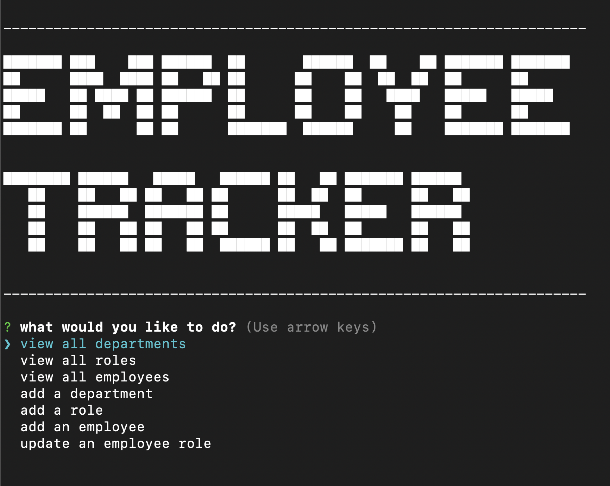

  

# Employee Tracker

## Description:

A command line application to manage a company's employee database.
Built with Node.js, Inquirer, and MySQL.

## Usage

The following video shows an example of the application being used from the command line:

[Video Demo](https://drive.google.com/file/d/1XF0hYgxERJA1ATB2K1t1t6J_hHePhaju/view?usp=sharing)

